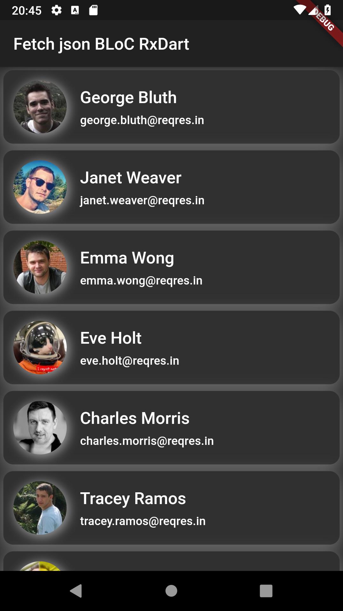
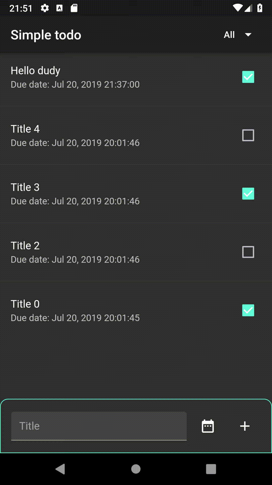
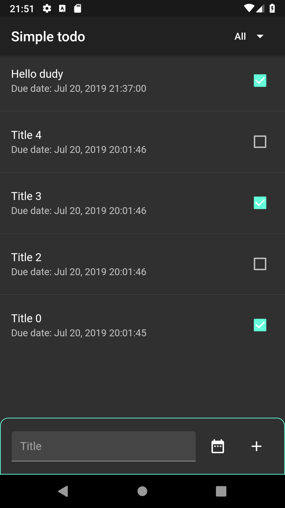

# bloc_rxdart_playground

## [fetch_json_bloc_rxdart](./fetch_json_bloc_rxdart)

Http + BLoC + RxDart

[Video](https://youtu.be/SLVujaxMuwM)

  

## [Flutter change theme](./flutter_change_theme)

BLoC + RxDart + RxSharedPrefs

[Video](https://youtu.be/ZQyi_LQymrI)

  

## [simple_todo](./simple_todo)

 BLoC + RxDart + SQLite

[Video 1](https://youtu.be/EUy9Sa8e5-o)

[Video 2](https://youtu.be/AJAJyxdbREs)

  
 

